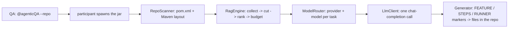

# AgenticQA — Architecture (Phase 1: telemetry · Phase 2: Java orchestrator + RAG)

## Goal

Capture the token usage of **every** interaction with AI models in GitHub Copilot
Chat, split it into **With AgenticQA** (`@agenticQA` conversations) vs
**Without AgenticQA** (all other chat), and show monthly totals on a local
dashboard that resets on the 1st of each month — on machines with **no admin
rights, no third-party installs, and VPN-only networking**.

## Design constraints and how they are met

| Constraint | Solution |
|---|---|
| No admin rights | Everything lives in the user profile: `%USERPROFILE%\.agenticqa` (data) and `%USERPROFILE%\.vscode\extensions` (extension). Only `127.0.0.1` traffic. |
| No third-party software | The collector runs inside the AgenticQA VS Code extension on the Node.js runtime that ships with VS Code. Persistence uses plain JSON files (atomic writes) — no database engine. |
| VPN / secure network | No outbound connections added. Dashboard + API are loopback-only. |
| Survive reboots / AgenticQA not running | Capture is performed by VS Code itself (a settings entry), not by our process. The token journal keeps growing on disk; the collector ingests the backlog whenever it starts. |
| Monthly reset on the 1st | Aggregation is bucketed by calendar month. The current month starts from zero automatically; prior months are snapshotted and kept. |

## What the exporter really writes (verified against a live machine)

Copilot Chat's `github.copilot.chat.otel` file exporter writes JSON lines of the
OTel SDK's **internal object shapes** — not the standard OTLP JSON wire format.
There are no spans in file mode. The line types that matter:

1. **Log records** — `{ hrTime:[sec,nsec], resource:{_rawAttributes:[...]},
   attributes:{...}, _body:... }` with a plain key/value `attributes` map:
   - `event.name = "gen_ai.client.inference.operation.details"` — **one exact
     record per LLM API call** with `gen_ai.usage.input_tokens`,
     `gen_ai.usage.output_tokens` (+ optional cache read/creation and reasoning
     tokens), `gen_ai.request.model`, `gen_ai.response.id`. This is the
     authoritative per-call source.
   - `event.name = "copilot_chat.session.start"` — per chat session, with
     `session.id` and `gen_ai.agent.name`.
   - `copilot_chat.agent.turn`, `copilot_chat.tool.call`, ... — ignored for totals.
2. **Metric batches** — `{ resource, scopeMetrics:[...] }` (histograms/counters,
   cumulative) — ignored; inference events are exact and simpler to consume.
3. **Empty `{}` separators** — ignored.

Important consequences:
- Events carry **no conversation id** (only `session.start` carries `session.id`).
- Session ("conversation") boundaries are reconstructed from `session.start`
  events; inference events are attributed to the latest session that started
  before them.

## Data flow

```mermaid
flowchart TD
    QA[QA engineer chats in Copilot Chat] --> |any mode, any model| CC[GitHub Copilot Chat]
    QA --> |@agenticQA prompts| P[AgenticQA participant<br/>counts its own tokens, reports marks]
    CC --> |built-in OTel file exporter<br/>github.copilot.chat.otel.*| J1[(copilot-otel.jsonl<br/>inference events + session starts)]
    P --> |classification marks<br/>HTTP or file fallback| M[(agenticqa-marks.jsonl)]
    J1 --> ING[Ingestor<br/>tails journals, dedupes, aggregates]
    M --> ING
    ING --> DB[(data/*.json<br/>daily.json · conversations.json · monthly_snapshots.json)]
    ING --> API[HTTP API + dashboard<br/>127.0.0.1:8787]
    API --> UI[Browser dashboard]
```

## Components

### 1. Capture (VS Code built-in)

Settings applied manually (see `manual-setup.md`) and re-enforced by the extension at startup:

```jsonc
{
  "github.copilot.chat.otel.enabled": true,
  "github.copilot.chat.otel.exporterType": "file",
  "github.copilot.chat.otel.outfile": "C:/Users/<you>/.agenticqa/otel/copilot-otel.jsonl",
  "github.copilot.chat.otel.captureContent": false
}
```

- Every LLM call becomes an inference event with exact token counts.
- `captureContent` stays **false** — prompts and responses are never stored.
- Because this is a setting in the user profile, capture persists across reboots
  and works regardless of whether any AgenticQA process is running.
- Per-call `gen_ai.client.inference.operation.details` events are only emitted
  for Copilot first-party models. Agent sessions on bring-your-own-key
  providers (e.g. DeepSeek) emit one `copilot_chat.agent.turn` event per turn
  instead. Summing turn input + output reproduces the provider's billed token
  totals exactly (verified against the DeepSeek usage dashboard: 747,974 in +
  22,522 out per session). Only the cache-hit/cache-miss split is an estimate
  (providers cache prefix blocks best-effort). AgenticQA tracks these as a
  separate **turns** metric.

### 2. Collector (inside the AgenticQA extension)

Pure Node.js modules under `vscode-extension/agenticqa-vscode/core/`:

- `normalize.js` — parser for the SDK-internal JSON journal (log records with
  `hrTime`/`attributes`; metrics and separators are ignored).
- `ingest.js` — tails the journals with durable offsets; dedupes inference
  events by `gen_ai.response.id`; rebuilds mark-derived buckets on startup;
  aggregates per day/month; snapshots past months. `copilot_chat.agent.turn`
  events are bucketed separately (`turns`), attributed to the model of their
  window-scoped session — never mixed into the per-call totals.
- `api.js` — REST endpoints + dashboard static files (loopback only).
- `leader.js` — HTTP server + leader/follower election across VS Code windows,
  with automatic takeover when the leader window closes.

### 3. The `@agenticQA` participant

Two modes:

- **Orchestrator mode (RAG)** — when `agenticqa-orchestrator.jar` is present in
  the extension's `orchestrator/` folder, the participant spawns
  `java -jar agenticqa-orchestrator.jar` (plus `--repo <path>` when the prompt
  contains one). The orchestrator resolves the project itself: `--repo` from
  the prompt, or `agenticqa.orchestrator.repoPath` in `agenticqa.properties`.
  The participant streams the orchestrator's output into the chat, lists the
  files the orchestrator wrote, and reports the orchestrator's exact token
  usage as its classification mark.
- **Fallback mode (phase 1)** — without the jar, the participant routes the
  prompt to the selected Copilot model and counts its own input/output tokens
  (`LanguageModelChat.countTokens`).

Both modes report a **classification mark** (request id, model, timestamps,
token counts) to the collector via `POST /api/agenticqa/mark`, with an
append-only file fallback so a mark is never lost when the server is briefly
down.

## Classification: With vs Without AgenticQA (residual model)

Because inference events carry no conversation id, the split is derived:

- **captured** = sum of all inference events (exact, per call, per model, per day).
- **With AgenticQA** = sum of the `@agenticQA` participant's marks (it counts
  its own requests' tokens precisely).
- **Without AgenticQA** = captured − With, clamped at 0 per field (per day in
  the daily chart, per month in the summary).

This stays exact without conversation linkage: AgenticQA reports exactly what it
spent; everything else is baseline. Sessions reconstructed from `session.start`
events are flagged "With" when a mark overlaps their time window (used for the
dashboard's session list; not needed for the totals).

## Storage (plain JSON, atomic writes)

| File | Contents |
|---|---|
| `otel/copilot-otel.jsonl` | raw capture journal (written by VS Code) |
| `otel/agenticqa-marks.jsonl` | classification marks (fallback channel) |
| `data/state.json` | per-file read offsets, last flush |
| `data/seen.json` | ingested event ids (dedup) |
| `data/daily.json` | `day → {captured: {model: counts}, with: {model: counts}}` |
| `data/conversations.json` | session boundaries + captured totals + With flag |
| `data/monthly_snapshots.json` | past-month totals (never deleted) |
| `data/events.jsonl` | normalized inference events (audit trail) |

Counts: `{in, out, cr (cache read), cc (cache create), re (reasoning), calls}`.
Displayed `totalTokens = input + output` (cache/reasoning shown as detail).
"With" buckets are rebuilt from the marks journal on every startup, so restarts
and crashes can never double-count marks.

## REST API (127.0.0.1 only)

| Method | Path | Purpose |
|---|---|---|
| GET | `/api/health` | collector mode, events, journal state |
| GET | `/api/usage/summary?month=YYYY-MM` | month totals: captured / with / without |
| GET | `/api/usage/daily?month=` | per-day with/without/captured series |
| GET | `/api/usage/models?month=` | per-model captured + with |
| GET | `/api/conversations?limit=` | recent sessions + classification |
| GET | `/api/months` | available months |
| GET | `/api/reconcile?month=` | participant-reported vs captured |
| POST | `/api/agenticqa/mark` | classification mark from the participant |
| GET | `/` | dashboard |

## Restart / failure semantics

- **VS Code is the capture point.** If no AgenticQA code is running, the journal
  still grows. The collector ingests the backlog on its next start.
- **No VS Code ⇒ no chat ⇒ nothing to capture.** There is no gap in coverage.
- **Multi-window:** one window is leader (owns ingestion + port 8787); others are
  followers and take over within ~30 s if the leader closes.
- **Storage safety:** single-writer (leader only) with atomic rename writes;
  offsets prevent re-reading; event-id dedup prevents double counting; mark
  buckets are rebuilt from the marks journal on startup.

## Scope and limitations (phase 1)

- Covers **Copilot Chat** LLM traffic exported by Copilot Chat's OTel exporter
  (ask / edit / agent modes, including extension-originated and internal
  Copilot calls). Inline code completions and Next Edit Suggestions use a
  different pipeline and are not captured; they can be added later via the
  GitHub Copilot Metrics API.
- Session attribution is time-based (latest `session.start` before each event),
  which is approximate when several sessions interleave.
- The exporter format is internal and may change; `normalize.js` is defensive
  and `unparsedLines` is surfaced in health for quick detection.
- Local per-machine dashboard. The JSON format is portable so a central
  aggregator can be introduced later (needs a VPN-reachable server).
- The `@agenticQA` participant now runs the Java orchestrator (phase 2) when
  the jar is installed; without the jar it keeps the phase-1 behaviour.

## Java orchestrator + RAG (phase 2)

The custom orchestrator behind `@agenticQA`. One Maven project (`pom.xml` at the
repository root) whose components live in **separate folders**:

| Folder | Package | Responsibility |
|---|---|---|
| `core/` | `com.agenticqa.core.*` | shared kernel: configuration, LLM client (OpenAI-compatible), document model, model routing |
| `rag/` | `com.agenticqa.rag.*` | retrieval (your work area): one entry point `RagEngine.buildContext(...)` — the orchestrator calls only this; the internals are yours to design |
| `orchestrator/` | `com.agenticqa.orchestrator.*` | the flow: discover repo layout -> ask RagEngine for context -> route -> one LLM call -> write files |
| `config/agenticqa.properties` | - | providers, models, routing rules, RAG settings (gitignored: holds API keys) |



Key properties:

- **Auto-discovery** — the orchestrator reads `pom.xml` and the standard Maven
  layout (`src/test/java`, `src/test/resources/features`, existing stepdefs /
  runner packages). The user never tells the AI where things go.
- **RAG** — the context builder is one entry point,
  `rag/RagEngine.buildContext(...)`. The pipeline calls this fixed signature,
  so the implementation can be developed independently.
- **Retrieval costs zero tokens** — the retrieval implementation runs in code;
  only the pieces that fit the token budget reach the prompt. The orchestrator
  logs the exact numbers (corpus size vs injected size) so the savings are
  visible in every chat reply.
- **Multi-provider + routing** — `agenticqa.properties` lists providers (each
  with endpoint, key, models) and keyword rules; `ModelRouter` picks
  provider:model per task. First matching rule wins, else the default.
- **One call, exact usage** — token counts come from the API `usage` field and
  are printed as `AGENTICQA_TOKENS prompt=N completion=N total=N` for the
  participant to report.
- **Generated files** are written into the discovered folders and listed as
  `AGENTICQA_WROTE <path>` lines.
- **Security** — API keys live in `config/agenticqa.properties` (gitignored) or
  in `<ID>_API_KEY` environment variables; no keys in source code.

Build: `mvn package` (JDK 11+) -> `target/agenticqa-orchestrator.jar`; the jar
plus the `config/` folder are copied into the extension's `orchestrator/` folder.

## Development

```bash
node dev/self-test.js   # tests of ingestion, residual split, dedup, restart
AGENTICQA_HOME=/tmp/aqa node dev/harness.js  # standalone collector (no VS Code)
node dev/e2e-fixture.js /tmp/aqa/otel/copilot-otel.jsonl  # synthetic journal lines
```

